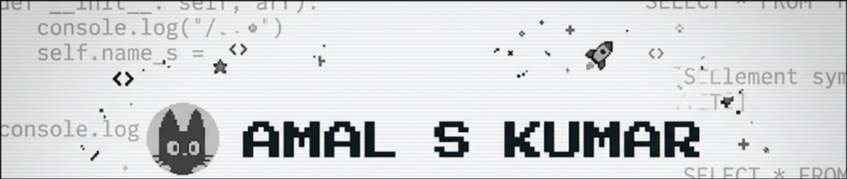
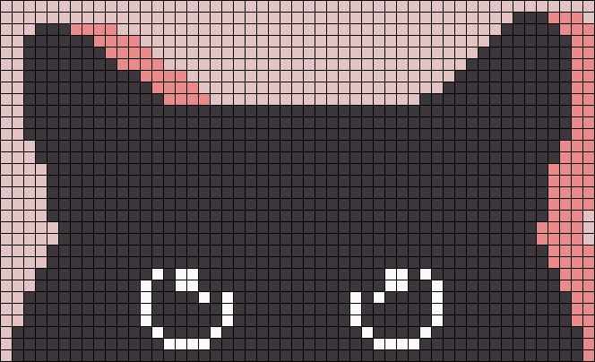

  

  
  
  
  

---

<h2 align="center">🐈 About Me</h2>

<table border="0">
  <tr>
    <td width="60%" valign="top">
      
Hello there! I'm <b>Amal S Kumar</b>, a passionate Full-Stack Developer with strong backend expertise based in Kochi, Kerala. I specialize in designing and deploying scalable web applications, REST APIs, and database-driven solutions.

      
Currently, I'm pursuing my <b>Masters of Computer Applications (MCA)</b> at Amal Jyothi College of Engineering, Kottayam (2025 - Present), after completing my BCA with a 7.82 CGPA from Mahatma Gandhi University.

      <ul>
        <li>💼 <b>Freelance Web Developer</b>: Successfully built and delivered 7+ production-ready client websites (Laravel, Django, PHP).</li>
        <li>🚀 <b>NASA SpaceApps Challenge</b>: Selected as a Global Nominee for the prestigious hackathon.</li>
        <li>🏆 <b>Achievements</b>: 2nd Prize in Idea Pitching Competition at MES College, and selected for central government IDE Bootcamp.</li>
      </ul>
    </td>
    <td width="40%" align="center" valign="middle">
      
    </td>
  </tr>
</table>

---

<h2 align="center">🛠️ Technologies & Tools</h2>

  <!-- Languages -->
  
  
  
  
  
  
  
  
   
  <!-- Frameworks & Libraries -->
  
  
  
  <!-- Databases -->
  
  
  
   
  <!-- Dev Tools & Infrastructure -->
  
  
  
  
  
  
  

---

<h2 align="center">📈 GitHub Statistics</h2>

  
  

  

