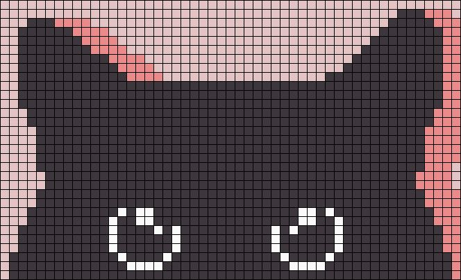

  

  
  
  
  

 

<h2 align="center">Backend-Focused Full Stack Developer</h2>

  <b>Building backend systems, developer tools, and software that solves real problems.</b>

 

<h2 align="center">About Me</h2>

  

  I am a <b>Backend-Focused Full Stack Developer</b> with a strong interest in
  backend engineering, software architecture, system design, and developer tooling.
    
  I primarily work with <b>Python and Django</b> and enjoy building
  REST APIs, authentication systems, database-driven applications,
  asynchronous workflows, and backend services.
    
  My development experience includes <b>Python, Django, PHP, Laravel, JavaScript,
  React, PostgreSQL, MySQL, Redis, Celery, AWS, Docker, Git, and Linux.</b>
    
  I am currently building <b>Noir CLI</b>, an AI-powered reliability engineering
  tool, while exploring better approaches to software testing, system reliability,
  and developer workflows.
    
  I am also focused on improving my <b>Data Structures & Algorithms</b>,
  system design, and overall backend engineering skills.
    
  Outside development, I enjoy customizing my <b>Arch Linux</b> environment
  and playing <b>competitive chess.</b>

 

<h2 align="center">Technologies & Tools</h2>

<h3 align="center">Languages</h3>

  
  
  
  
  
  

<h3 align="center">Frameworks & Libraries</h3>

  
  
  
  
  

<h3 align="center">Databases & Infrastructure</h3>

  
  
  
  
  
  
  

<h3 align="center">Tools & Environment</h3>

  
  
  
  
  

 

<h2 align="center">Current Focus</h2>

  <b>Backend Engineering</b> •
  <b>System Design</b> •
  <b>Reliability Engineering</b> •
  <b>Developer Tools</b> •
  <b>Data Structures & Algorithms</b> •
  <b>AI Systems</b>

 

  <i>Build. Break. Understand. Improve.</i>

  <b>— Amal S Kumar</b>

