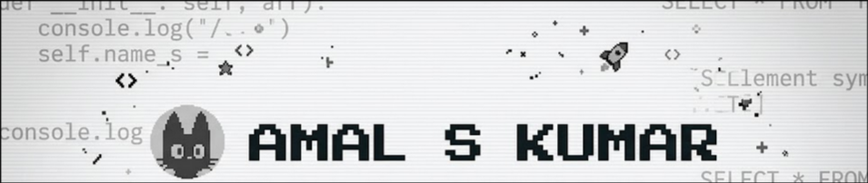

  

  
  
  
  

 

<h2 align="center">About Me</h2>

  

 <b>I am a Backend-Focused Full Stack Developer specializing in Python, Django, PHP, and Laravel, with experience building scalable and secure web applications.</b> 
My primary focus is designing REST APIs, authentication systems, and database-driven backend services that are reliable and maintainable. 
I have built projects including a digital art marketplace, a taxi booking platform, e-commerce applications, and developer-focused tools. 
I work with PostgreSQL, MySQL, SQLite, Redis, Celery, Git, AWS, and Linux to develop and deploy modern applications. 
Currently, I am building <b>Noir CLI</b>, an AI-powered reliability engineering tool, alongside a physical asset tracking SaaS platform. 
I enjoy solving data structures and algorithms problems, exploring system design, and continuously improving my backend engineering skills. 
Outside development, I customize my Arch Linux environment and enjoy playing competitive chess. 
I am always eager to learn new technologies, contribute to meaningful projects, and build software that solves real-world problems. 

  

  

<h2 align="center"> Technologies & Tools</h2>

  <!-- Languages -->
  
  
  
  
  
  
  
  
   
  <!-- Frameworks & Libraries -->
  
  
  
  <!-- Databases -->
  
  
  
   
  <!-- Dev Tools & Infrastructure -->
  
  
  
  
  
  
  

